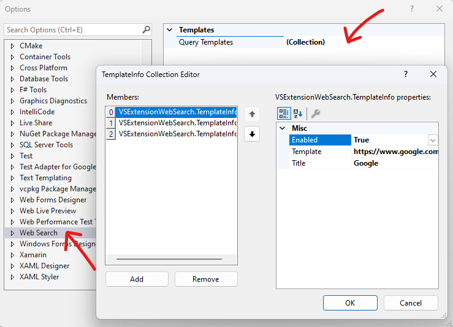
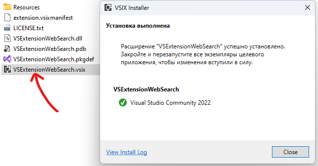

# 🔎︎ Web Search Context Menu | Visual Studio 2022

📌 Контекстное меню с поиском по нескольким сайтам для Visual Studio 2022.

Контекстное меню отображается только при выделении текста в редакторе:


## Настройка поисковых сайтов

Откройте параметры расширения `[Tools] -> [Options] -> [Web Search]`.



* Измените, добавьте или удалите шаблон. Поисковая строка должна содержать `{{QUERY}}`, которая будет заменена выбранным в редакторе текстом.
* Переместите шаблон кнопками(стрелками) `Up/Down`. Пункты контекстного меню имеют тот же порядок что и в списке опций.
* `Enabled` позволяет деактивировать шаблон контекстного меню.

По умолчанию все шаблоны используют Google с дополнительным параметром сайта, например:

```
Title    : "Microsoft"
Template : "https://www.google.com/search?as_q={{QUERY}}&as_sitesearch=microsoft.com"
Enabled  : true
```

Деактивация всех пунктов `Enabled:false` не вызывает полного отключения и отобразит один пункт с поисковой системой по умолчанию.

После изменения проверяйте запрос, страница параметров не предупреждает об ошибочных шаблонах в которых не найден `{{QUERY}}`.

## Сборка и установка

Клонируйте репозиторий и откройте решение `VSExtensionWebSearch.sln`. Выберите конфигурацию сборки `Release + x64`. Соберите решение. Найдите каталог `VSExtensionWebSearch/VSExtensionWebSearch/bin/x64/Release` и запустите `VSExtensionWebSearch.vsix`:



При установке может потребоваться выйти из Visual Studio.

Удачного поиска 🎯!
